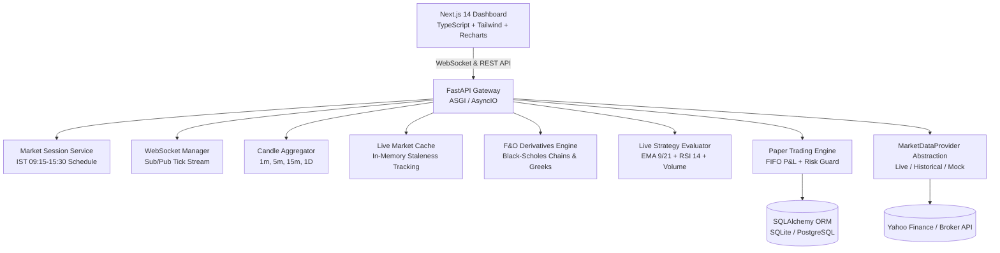

# QuantDesk India: Live Indian Market Monitoring & Algorithmic Paper Trading Platform

[](https://python.org)
[](https://fastapi.tiangolo.com)
[](https://nextjs.org)
[](https://tailwindcss.com)
[](https://postgresql.org)
[](LICENSE)

A portfolio-quality, production-grade **Indian Stock Market Real-Time Monitoring and Paper Trading Platform**. Built with FastAPI, Next.js 14, and WebSockets, supporting equities, benchmark Indian indices, and derivatives (F&O option chains).

> **CRITICAL DISCLAIMER**: This application is strictly an educational simulation and paper-trading system. It does **NOT** place real trades, deploy real money, or execute orders on live brokerages. Live brokerage order execution is intentionally omitted.

---

## 🏛️ System Architecture



---

## 🚀 Key Features

* **Real-Time Indian Market Coverage**:
  * **Top 8 NSE Equities Watchlist**: `RELIANCE`, `TCS`, `INFY`, `HDFCBANK`, `ICICIBANK`, `SBIN`, `ITC`, `LT`.
  * **Benchmark Indices**: `NIFTY 50`, `SENSEX`, `BANK NIFTY` with daily ranges, change metrics, and interactive charts.
  * **F&O Derivatives Module**: Real-time NSE Option Chain featuring Call Options (CE), Put Options (PE), Strike Ladder with ATM detection, Open Interest (OI), Change in OI, and Implied Volatility (IV).
* **Strict Data Transparency Labels**:
  * Every widget explicitly tags data freshness: `LIVE`, `DELAYED (15m)`, `HISTORICAL EOD`, `DEMO DATA / SIMULATED`, `STALE`, or `UNAVAILABLE`.
  * In-memory cache automatically flags quotes older than 60 seconds as `STALE`.
* **Indian Market Session Schedule**:
  * Accurate `Asia/Kolkata` time awareness:
    * `PRE-OPEN`: 09:00 - 09:15 IST
    * `MARKET OPEN`: 09:15 - 15:30 IST
    * `POST-MARKET`: 15:30 - 16:00 IST
    * `MARKET CLOSED`: Weekends and after 16:00 IST
* **Real-Time Streaming & Candle Aggregation**:
  * Full-duplex WebSocket connection at `/api/v1/ws/market` with subscription management.
  * In-flight aggregation of raw price ticks into `1m`, `5m`, `15m`, and `1D` OHLCV candlestick bars.
* **Live Strategy Signal Evaluator**:
  * Dual Exponential Moving Average (EMA 9 & EMA 21) crossover with RSI (14) momentum filter and Volume Moving Average (20) confirmation.
  * Evaluates live ticks against active strategy rules in real-time.
* **100% Risk-Guarded Paper Trading Engine**:
  * Executes market orders at live LTP with real-time unrealized and realized P&L accounting.
  * Rigorous Indian statutory transaction cost model (STT, Exchange Turnover, SEBI charges, GST, Stamp Duty, Slippage).
  * Enforces maximum capital allocation per trade and prevents naked short sales.

---

## 📂 Project Structure

```
TradeBot/
├── backend/
│   ├── app/
│   │   ├── api/v1/endpoints/  # FastAPI routes (market, fno, ws, stocks, strategy, backtest, paper)
│   │   ├── backtesting/       # Backtesting engine, performance metrics, and cost model
│   │   ├── core/              # Global config, pydantic settings, IST time helper
│   │   ├── database/          # SQLAlchemy session, engine, and init seed
│   │   ├── models/            # SQLAlchemy ORM models (stocks, orders, trades, positions, accounts)
│   │   ├── paper_trading/     # Risk manager, portfolio accounting, order matching
│   │   ├── schemas/           # Pydantic schemas (market quotes, F&O chains, orders, signals)
│   │   ├── services/
│   │   │   ├── market_data/   # MarketDataProvider abstraction (Base, Live, Mock, Historical)
│   │   │   ├── market_cache.py# In-memory quote cache with staleness detection
│   │   │   ├── market_status.py# IST trading session evaluator
│   │   │   ├── candle_builder.py# Tick-to-candle OHLCV aggregator (1m, 5m, 15m, 1D)
│   │   │   ├── live_strategy_evaluator.py# Real-time strategy signal bridge
│   │   │   └── indicators.py  # EMA, RSI, Volume MA indicators
│   │   ├── strategies/        # BaseStrategy & EMARsiVolumeStrategy
│   │   └── main.py            # ASGI application entrypoint
│   ├── tests/                 # Comprehensive Pytest suite (73 tests, 100% offline)
│   ├── Dockerfile
│   └── requirements.txt
├── frontend/
│   ├── src/
│   │   ├── app/               # Next.js 14 App Router (layout, page, styles)
│   │   ├── components/        # Dashboard, Indices, F&O Option Chain, Market, Strategy, Paper
│   │   ├── hooks/             # useMarketWebSocket custom hook
│   │   ├── services/          # Strongly-typed API client
│   │   └── types/             # TypeScript data contracts matching Pydantic schemas
│   ├── Dockerfile
│   └── package.json
├── docs/
│   ├── ARCHITECTURE.md        # Architectural design & provider abstraction
│   ├── TRADING_CONCEPTS.md    # Financial mechanics, Option Greeks, and indicators
│   └── INTERVIEW_GUIDE.md     # Technical interview questions and explanations
├── docker-compose.yml         # Multi-container orchestration (DB + Backend + Frontend)
├── .env.example
└── README.md
```

---

## ⚡ Quick Start

### Option 1: Local Development

#### 1. Backend Setup (Python 3.11+)
```bash
cd backend

# Create and activate virtual environment
python -m venv venv
# On Windows:
.\venv\Scripts\activate
# On Linux/macOS:
source venv/bin/activate

# Install dependencies
pip install -r requirements.txt

# Start FastAPI development server (SQLite auto-initializes)
uvicorn app.main:app --reload --host 127.0.0.1 --port 8000
```
* Interactive API Documentation will be available at [http://127.0.0.1:8000/docs](http://127.0.0.1:8000/docs).

#### 2. Frontend Setup (Node 18+)
```bash
cd frontend

# Install packages
npm install

# Start Next.js development server
npm run dev
```
* Dashboard will be live at [http://localhost:3000](http://localhost:3000).

---

## 🧪 Running Automated Tests

The backend includes a comprehensive, 100% offline-isolated Pytest test suite covering market provider abstraction, caching, market status schedules, F&O option chains, WebSocket streaming, indicators, strategies, and paper trading risk management:

```bash
cd backend
python -m pytest tests/ -v
```

Output:
```
============================== 73 passed in 3.46s ==============================
```

---

## 📄 License

This project is licensed under the MIT License - see the [LICENSE](LICENSE) file for details.