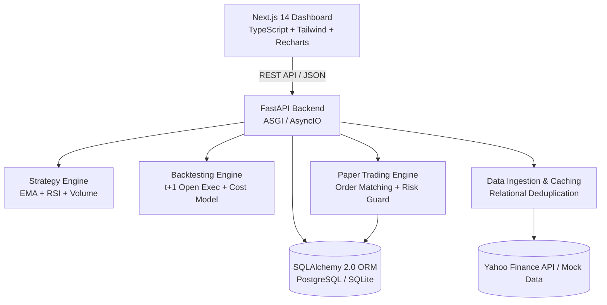

# QuantDesk India: Algorithmic Paper Trading & Research Platform

[](https://python.org)
[](https://fastapi.tiangolo.com)
[](https://nextjs.org)
[](https://tailwindcss.com)
[](https://postgresql.org)
[](LICENSE)

A portfolio-quality, production-grade **Indian Stock Market Paper Trading Bot and Quantitative Backtesting Platform**. Designed specifically for software engineering reviews, quantitative trading evaluations, and technical interviews.

> **CRITICAL DISCLAIMER**: This application is strictly an educational simulation and paper-trading system. It does **NOT** place real trades, deploy real money, or guarantee trading profits. Live brokerage execution is intentionally omitted.

---

## 🏛️ System Architecture



---

## 🚀 Key Features

* **NSE Equities Universe**: Native support for top Indian blue-chip equities (`RELIANCE.NS`, `TCS.NS`, `INFY.NS`, `HDFCBANK.NS`, `ICICIBANK.NS`).
* **Rule-Based Explainable Strategy**: Fast EMA (9) + Slow EMA (21) crossover with RSI (14) momentum confirmation and Volume Moving Average (20) filter. Completely free of black-box ML.
* **Zero Look-Ahead Bias Backtesting**: Signals calculated at bar $t$'s Close are strictly filled at bar $t+1$'s Open. Includes a conservative intrabar stop-loss priority rule.
* **Realistic Indian Transaction Cost Model**: Models statutory Indian Cash Delivery charges:
  * STT (0.1% on buy & sell)
  * Exchange Turnover (0.00325%)
  * SEBI Charges (0.0001%)
  * GST (18% on fees)
  * Stamp Duty (0.015% on buy)
  * Slippage (0.05%)
* **Strict Paper Trading & Risk Layer**:
  * Prevents overselling / naked short sales.
  * Enforces maximum capital allocation per trade (default 10%).
  * Calculates real-time FIFO unrealized and realized P&L.
* **Interactive Next.js Dashboard**:
  * Portfolio overview with real-time equity & cash allocation.
  * Multi-timeframe interactive candlestick & indicator charts.
  * Parameter-customizable Strategy Signal evaluator.
  * Comparative Backtesting Lab with equity curves vs. Buy & Hold benchmark.
  * Trade Audit Log with tax and slippage transparency.

---

## 📂 Project Structure

```
TradeBot/
├── backend/
│   ├── app/
│   │   ├── api/v1/endpoints/  # FastAPI route handlers (stocks, strategy, backtest, paper, bot)
│   │   ├── backtesting/       # Backtesting engine, performance metrics, and cost model
│   │   ├── core/              # Global config, pydantic settings, logging
│   │   ├── database/          # SQLAlchemy session, engine, and migrations
│   │   ├── models/            # SQLAlchemy ORM models (stocks, orders, trades, positions, accounts)
│   │   ├── paper_trading/     # Risk manager, portfolio accounting, order matching
│   │   ├── schemas/           # Pydantic validation schemas
│   │   ├── services/          # Market data providers, indicators, validation, ingestion
│   │   ├── strategies/        # BaseStrategy & EMARsiVolumeStrategy
│   │   └── main.py            # ASGI application entrypoint
│   ├── tests/                 # Comprehensive Pytest test suite (41 tests, 100% offline)
│   ├── Dockerfile
│   └── requirements.txt
├── frontend/
│   ├── src/
│   │   ├── app/               # Next.js 14 App Router (layout, page, styles)
│   │   ├── components/        # Dashboard, Market, Strategy, Backtest, Paper, Trades views
│   │   ├── services/          # Strongly-typed API client
│   │   └── types/             # TypeScript data contracts matching Pydantic schemas
│   ├── Dockerfile
│   └── package.json
├── docs/
│   ├── ARCHITECTURE.md        # Deep dive into architectural design decisions
│   ├── TRADING_CONCEPTS.md    # Guide to indicators, market mechanics, and math
│   └── INTERVIEW_GUIDE.md     # 18 Technical Interview Questions & In-Depth Answers
├── docker-compose.yml         # Multi-container orchestration (DB + Backend + Frontend)
├── .env.example
└── README.md
```

---

## ⚡ Quick Start

### Option 1: Local Development

#### 1. Backend Setup (Python 3.11+)
```bash
cd backend

# Create and activate virtual environment
python -m venv venv
# On Windows:
.\venv\Scripts\activate
# On Linux/macOS:
source venv/bin/activate

# Install dependencies
pip install -r requirements.txt

# Start FastAPI development server (SQLite auto-initializes)
uvicorn app.main:app --reload --host 127.0.0.1 --port 8000
```
* Interactive API Documentation will be available at [http://127.0.0.1:8000/docs](http://127.0.0.1:8000/docs).

#### 2. Frontend Setup (Node 18+)
```bash
cd frontend

# Install packages
npm install

# Start Next.js development server
npm run dev
```
* Dashboard will be live at [http://localhost:3000](http://localhost:3000).

---

### Option 2: Docker Compose (Production Stack)

Run the full stack (PostgreSQL + FastAPI + Next.js) with a single command:
```bash
docker compose up --build
```
* Frontend: [http://localhost:3000](http://localhost:3000)
* Backend API: [http://localhost:8000/api/v1](http://localhost:8000/api/v1)
* API Swagger Docs: [http://localhost:8000/docs](http://localhost:8000/docs)

---

## 🧪 Running Automated Tests

The backend includes a comprehensive, 100% offline-isolated Pytest test suite covering indicators, strategies, backtesting execution, risk management, and API endpoints.

```bash
cd backend
python -m pytest tests/ -v
```

Output:
```
============================== 41 passed in 4.25s ==============================
```

---

## 📚 Technical Interview Preparation

Review [`docs/INTERVIEW_GUIDE.md`](docs/INTERVIEW_GUIDE.md) for in-depth answers to core technical interview questions:
1. Architectural choices: FastAPI vs Flask/Django, PostgreSQL vs MongoDB/Redis.
2. Financial mathematics: EMA weighting vs SMA, Wilder's RSI smoothing.
3. Quantitative rigor: Preventing look-ahead bias, handling transaction costs and slippage.
4. Risk engineering: Preventing overselling, atomic transaction isolation, and pluggable broker adapters.

---

## 📄 License

This project is licensed under the MIT License - see the [LICENSE](LICENSE) file for details.